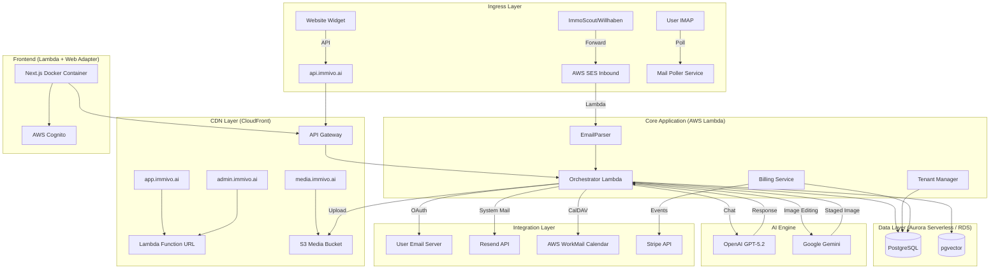

# System Architecture

## 🏗 High-Level Übersicht

Die Plattform basiert auf einer **AWS-Serverless-Architektur**, die auf Skalierbarkeit, Sicherheit und Wartungsarmut ausgelegt ist. Die Kernlogik ist in Node.js/TypeScript geschrieben und orchestriert die Kommunikation zwischen E-Mail-Providern, der KI-Engine und der Datenbank.

## 🧩 Komponenten-Details

### 1. Ingress & Lead Intake
*   **E-Mail Parser (AWS Lambda):** Verarbeitet eingehende E-Mails von Portalen. Nutzt Regex und DOM-Parsing, um Lead-Daten (Name, E-Mail, Telefon, Objekt-ID, Nachricht) zu extrahieren.
*   **Mail Poller:** Ein Hintergrund-Service, der optional IMAP-Postfächer der Makler auf neue direkte Antworten überwacht (für White-Labeling ohne Weiterleitung).

### 2. Core Application
*   **Orchestrator (Lambda + API Gateway):** Die zentrale Schaltstelle. Verwaltet den Status eines Leads (`NEW` -> `CONTACTED` -> `CONVERSATION` -> `BOOKED`). Entscheidet, wann die KI aufgerufen wird und wann ein Mensch eingreifen muss.
*   **Lead Scoring Engine (Phase 3.1):** `LeadScoringService.ts` calculates 0-100 scores based on: timeFrame (25pts), financing (25pts), budget match (15pts), source quality (15pts), engagement (10pts), completeness (10pts). Scores are auto-calculated on lead creation. New `score` and `scoreFactors` fields on the Lead model.
*   **Property Recommendations (Phase 3.2):** Enhanced `PropertyMatchingService.ts` with `getPropertyRecommendations()` that combines rule-based filtering (budget, type, location, rooms, area) with pgvector semantic similarity boost.
*   **Follow-Up Sequences (Phase 3.3):** `FollowUpService.ts` schedules automatic follow-ups at Day 3/7/14 via EventBridge. Checks engagement before acting. Auto-marks leads as LOST after 14 days without response.
*   **Smart Email Processing (Phase 3.4):** `AutoClickService.ts` — Puppeteer auto-click for portal email links, extracts lead data (name, email, phone, message). `LeadEnrichmentService.ts` — duplicate detection, phone normalization (DE/AT/CH), completeness scoring (0-100%). `SentimentService.ts` — AI sentiment analysis (gpt-5-mini) for email responses: sentiment level, urgency, emotional tone, buying/risk signals; also `quickScore()` for keyword-based checks.
*   **CacheService (Phase 4.1):** In-memory cache with Redis-compatible interface (get/set/getJSON/setJSON, TTL, namespaced keys, rate limiting via `checkRateLimit()`, cache-aside via `getOrSet()`). Ready to swap to ElastiCache Redis.
*   **QueueService (Phase 4.4):** In-memory async job queue with SQS-compatible interface. Named queues: auto-click, email-send, pdf-generate, image-process, embedding, lead-enrichment, sentiment-analysis. Retry with exponential backoff, concurrency limit 3. Ready to swap to SQS.
*   **PredictiveService (Phase 5.2):** `predictConversion(leadId)` — conversion probability 0-99% (lead score, response time, financing, source, engagement, viewings). `predictContactTime(tenantId)` — optimal contact hour/day from historical patterns. `estimatePrice()` — property price via comparable analysis with IQR outlier removal.
*   **ABTestService (Phase 5.4):** In-memory A/B testing. Create experiments with weighted variants, deterministic MD5 assignment, conversion tracking, Z-test statistical significance.
*   **Tenant Manager:** Verwaltet die Mandanten (Immobilienfirmen), deren Konfigurationen (SMTP-Zugangsdaten, Routing-Regeln) und Benutzerrechte.
*   **Encryption Service:** AES-256-GCM Verschlüsselung für sensible Daten (FTP-Passwörter, API-Keys, OAuth-Tokens).
*   **PDF Service:** Generiert Exposé-PDFs mit Puppeteer, inkl. QR-Codes für Videos/360°-Touren.
*   **Email Service:** OAuth-Integration für Gmail und Outlook Mail (Token-Management, Senden/Empfangen).
*   **Calendar Service:** OAuth-Integration für Google Calendar und Microsoft Outlook Calendar.

### 3. Data Layer
*   **PostgreSQL:** Speichert relationale Daten: Tenants, Users, Leads, Properties, CalendarEvents.
    *   **Dev/Stage:** RDS Single Instance (`t4g.micro`) zur Kostenoptimierung.
    *   **Lokal:** Neon.tech (serverless Postgres) für lokale Entwicklung.
    *   **Prod:** Aurora Serverless v2 für Skalierbarkeit und HA.
*   **pgvector:** Speichert Embeddings von Exposés und vergangenen Konversationen, um der KI ein "Langzeitgedächtnis" zu geben (RAG - Retrieval Augmented Generation).
    *   **Embedding Table (Phase 2.2):** Custom `Embedding` table with pgvector `vector(1536)` column for semantic search. Uses OpenAI `text-embedding-3-small` (1536 dimensions). Embeddings are auto-generated on Property/Lead create/update.
*   **Full-Text Search (Phase 5.1):** PostgreSQL `tsvector`/`tsquery` with German stemming. Auto-updated via database triggers on Property and Lead tables. Weighted ranking: title=A, address=B, description=C. Exposed via `/search` API endpoint.

### New API Endpoints (Phases 4–5)
*   **Predictive:** `GET /leads/:id/prediction` — conversion prediction; `GET /analytics/contact-time` — optimal contact time; `POST /analytics/price-estimate` — property price estimation.
*   **Admin:** `GET /admin/platform/cache-stats` — cache & queue stats; `GET /admin/ab-tests` — list experiments; `POST /admin/ab-tests` — create; `POST /admin/ab-tests/:id/start` — start; `POST /admin/ab-tests/:id/end` — end; `GET /admin/ab-tests/:id/results` — results with significance.

### Email-Ingestion Flow (Smart Processing)
When a new lead is created from email: (1) LeadEnrichmentService runs async (duplicate check, phone normalize, completeness); (2) SentimentService analyzes the lead's message (buying/risk signals stored as activity); (3) if `hasClickLink`: AutoClickService is queued via QueueService to extract lead data from the portal page.

### 4. AI Engine
*   **Chat Completions API (Assistants API deprecated, sunset Aug 2026):** The chat system uses the Chat Completions API with routed tool subsets instead of the deprecated Assistants API. The OpenAI Responses API is the recommended successor for potential future migration. Conversation history is managed per user.
*   **Chat & Tools:** OpenAI GPT-5.2 (flagship, Dec 2025, knowledge cutoff Aug 2025) — Jarvis-Assistent für Lead-Kommunikation, CRM-Aktionen, Exposé-Erstellung. Unterstützt **Multi-Round Tool Calls** (bis zu 8 Runden pro Antwort) für komplexe Aufgaben. Uses `max_completion_tokens` (replaces deprecated `max_tokens`).
*   **Image Editing:** Google Gemini (gemini-2.5-flash-image) — Virtual Staging im KI-Bildstudio und direkt im Jarvis-Chat via `virtual_staging`-Tool.
*   **Multi-Agent Router (Phase 2.3):** `AgentRouter.ts` uses gpt-5-mini to classify user intent into categories (smalltalk, crm, email, calendar, expose, memory, multi). Smalltalk goes directly to gpt-5-mini with no tools (cost-optimized). Other categories receive filtered tool subsets for faster, more accurate responses. Email parsing/reading also uses gpt-5-mini; email response generation uses gpt-5.2.
*   **pgvector RAG & semantic_search (Phase 2.2):** `EmbeddingService.ts` handles embedding generation via `text-embedding-3-small`, storage in the Embedding table, and cosine similarity search. New Jarvis tool `semantic_search` enables natural language entity search across Properties and Leads.
*   **63+ Tools:** Leads, Properties (inkl. aller Felder), Exposés, Templates, Team-Chat, Statistiken, Virtual Staging, Gedächtnis, `semantic_search` u.v.m.
*   **Pricing (OpenAI):** gpt-5.2 $1.75/$14 per 1M tokens (input/output), gpt-5-mini $0.25/$2 per 1M tokens.
*   **Aufgaben:**
    *   **Intent Recognition:** Was will der Lead? (Besichtigung, Frage, Absage?)
    *   **Response Generation:** Erstellen von natürlichen, mehrsprachigen Antworten.
    *   **Extraction:** Strukturierte Daten aus Freitext ziehen (z.B. Terminwunsch "nächsten Dienstag").
    *   **Exposé-Erstellung:** Live-Bearbeitung von Exposés im Editor via Tool-Calls.
    *   **Virtual Staging:** KI-basierte Bildbearbeitung (Möblierung) im Bildstudio und direkt im Jarvis-Chat. Bilder können von Properties oder Chat-Uploads stammen. Ergebnisse werden inline im Chat angezeigt und optional einer Property zugewiesen.
    *   **Datei-Verarbeitung:** CSV/Excel-Import, PDF-Analyse, Bild-Erkennung.
*   **Chat UX:**
    *   **Live Tool-Tags:** Pulsierende blaue Tags während der Tool-Ausführung, statisch nach Abschluss.
    *   **Inline-Bilder:** Ergebnis-Bilder (z.B. Virtual Staging) direkt im Chat als klickbare Bilder.
    *   **Saubere Antworten:** Kein JSON-Leak, keine internen Gedanken — nur die finale Antwort.

### 5. Integration Layer
*   **E-Mail Outbound:**
    *   **Lead-Kommunikation (OAuth):** Gmail oder Outlook Mail über OAuth-Integration (White-Labeling über Makler-Domain).
    *   **System-E-Mails (Resend):** Benachrichtigungen, Erinnerungen, Eskalationen via Resend API (Absender: noreply@immivo.ai).
*   **E-Mail Inbound:** AWS SES empfängt E-Mails (Portal-Weiterleitungen) → Email-Parser Lambda extrahiert Lead-Daten.
*   **E-Mail Postfächer:** AWS WorkMail (dennis.kral@immivo.ai, josef.leutgeb@immivo.ai, office@immivo.ai, support@immivo.ai).
*   **Kalender:** AWS WorkMail Kalender via CalDAV (geplant: Google Meet Integration für Videocalls).
*   **Medien:** AWS S3 für Bildupload (Objekt-Fotos, Grundrisse, Bug-Report-Screenshots), ausgeliefert via **CloudFront CDN** (`media.immivo.ai`).
*   **Stripe:** Abwicklung von Subscriptions. Webhooks von Stripe aktualisieren den Lizenz-Status im `Tenant Manager`.

### 6. Frontend (AWS Lambda)
*   **Framework:** Next.js 15 (App Router).
*   **Hosting:** **AWS Lambda (Docker Image)**.
    *   Wir nutzen den **AWS Lambda Web Adapter**, um die Next.js App als normalen Webserver im Container laufen zu lassen.
    *   Dies ermöglicht "Scale to Zero" (0€ Kosten bei Inaktivität) und unendliche Skalierung bei Last.
*   **Auth:** AWS Cognito User Pool für sicheren Login/Registrierung (Custom UI, keine Amplify Authenticator).

## 🔒 Sicherheit & Compliance

### Datenhaltung
*   **Region:** Alle Daten verbleiben in AWS `eu-central-1` (Frankfurt).
*   **Verschlüsselung:** Datenbanken sind `At-Rest` verschlüsselt (AWS KMS). API-Traffic ist `In-Transit` verschlüsselt (TLS 1.3).
*   **Credentials:** SMTP-Passwörter und OAuth-Tokens werden mit AES-256-GCM verschlüsselt in der DB gespeichert.

### Multi-Tenancy
*   **Logische Trennung:** Jede Datenbank-Abfrage erzwingt einen `WHERE tenant_id = X` Filter.
*   **Automatische TenantId:** API-Endpoints holen die `tenantId` automatisch vom authentifizierten User.
*   **Rollen-Konzept:**
    *   `SUPER_ADMIN`: Systemweiter Zugriff.
    *   `ADMIN`: Verwaltet Firma, Billing, User.
    *   `AGENT`: Zugriff auf zugewiesene Leads und eigenen Kalender.

## ⚡️ Skalierbarkeit & Environments

### Infrastructure as Code (IaC)
Wir nutzen **AWS CDK (Cloud Development Kit)**, um die gesamte Infrastruktur im Code zu definieren.

### Infrastructure Enhancements
*   **Connection Pooling:** Optimized for Lambda (3 connections per instance) to balance concurrency and resource usage.
*   **Structured JSON Logging:** CloudWatch logs use structured JSON format for easier querying and analysis.
*   **Security Headers:** HSTS, X-Content-Type-Options, X-Frame-Options, and related security headers configured across APIs.
*   **Fine-Tuning Data Export:** Endpoint available for exporting fine-tuning-ready data.

### CDN & DNS (CloudFront + Route53)
*   **Route53 Hosted Zone:** `immivo.ai` — verwaltet DNS fuer alle Subdomains (app, api, admin, media) sowie Resend-Verifizierung.
*   **ACM Wildcard-Zertifikat:** `*.immivo.ai` + `immivo.ai` (us-east-1, fuer CloudFront).
*   **CloudFront Distributions:**
    *   `app.immivo.ai` → Frontend Lambda URL (E1E8VMUP3UA4TJ)
    *   `api.immivo.ai` → API Gateway (E1F9SS8QE17ZZP)
    *   `admin.immivo.ai` → Frontend Lambda URL (E1XYO1OK2QOZQA)
    *   `immivo.ai` → Frontend Lambda URL (E24ZLYKGX22SZJ)
    *   `media.immivo.ai` → S3 Media Bucket via OAC (**CDK-verwaltet**, Phase 4.2)
*   **Caching:** Media-CDN nutzt `CachePolicy.CACHING_OPTIMIZED` (TTL max 1 Jahr, gzip/brotli Kompression).
*   **Protokoll:** HTTP/2+3, TLS 1.2+, Price Class 100 (EU + Nordamerika).

### Environment-Strategie
1.  **Dev** (`Immivo-Dev`):
    *   Für die tägliche Entwicklung.
    *   **Deployment:** Automatisch bei Push auf `main` (GitHub Actions).
    *   Ressourcen: RDS Micro, Lambda Frontend (Scale to Zero).
2.  **Stage** (`Immivo-Stage`):
    *   Spiegelbild der Produktion.
    *   **Deployment:** Manuell via GitHub Actions (Workflow Dispatch).
3.  **Prod** (`Immivo-Prod`):
    *   Das Live-System.
    *   **Deployment:** Manuell via GitHub Actions (Workflow Dispatch).
    *   Backups und High-Availability aktiviert.

### Lokale Entwicklung
*   **Frontend:** `npm run dev` auf Port 3000
*   **Backend:** `npm run dev` auf Port 3001 (mit nodemon)
*   **Datenbank:** Neon.tech (kostenlose serverless Postgres)
*   **Uploads:** AWS S3 (Production) via CloudFront CDN, lokal in `./uploads` als Fallback (Development)
