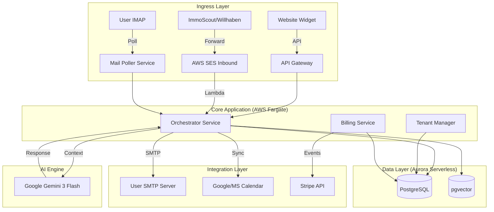

# System Architecture

## 🏗 High-Level Übersicht

Die Plattform basiert auf einer **AWS-Serverless-Architektur**, die auf Skalierbarkeit, Sicherheit und Wartungsarmut ausgelegt ist. Die Kernlogik ist in Node.js/TypeScript geschrieben und orchestriert die Kommunikation zwischen E-Mail-Providern, der KI-Engine (Gemini) und der Datenbank.

## 🧩 Komponenten-Details

### 1. Ingress & Lead Intake
*   **E-Mail Parser (AWS Lambda):** Verarbeitet eingehende E-Mails von Portalen. Nutzt Regex und DOM-Parsing, um Lead-Daten (Name, E-Mail, Telefon, Objekt-ID, Nachricht) zu extrahieren.
*   **Mail Poller:** Ein Hintergrund-Service, der optional IMAP-Postfächer der Makler auf neue direkte Antworten überwacht (für White-Labeling ohne Weiterleitung).

### 2. Core Application
*   **Orchestrator:** Die zentrale Schaltstelle. Verwaltet den Status eines Leads (`NEW` -> `CONTACTED` -> `CONVERSATION` -> `BOOKED`). Entscheidet, wann die KI aufgerufen wird und wann ein Mensch eingreifen muss.
*   **Tenant Manager:** Verwaltet die Mandanten (Immobilienfirmen), deren Konfigurationen (SMTP-Zugangsdaten, Routing-Regeln) und Benutzerrechte.

### 3. Data Layer
*   **PostgreSQL:** Speichert relationale Daten: Tenants, Users, Leads, Properties, CalendarEvents.
*   **pgvector:** Speichert Embeddings von Exposés und vergangenen Konversationen, um der KI ein "Langzeitgedächtnis" zu geben (RAG - Retrieval Augmented Generation).

### 4. AI Engine (Google Gemini 3 Flash)
*   **Modell:** Gemini 3 Flash Preview.
*   **Aufgabe:**
    *   **Intent Recognition:** Was will der Lead? (Besichtigung, Frage, Absage?)
    *   **Response Generation:** Erstellen von natürlichen, mehrsprachigen Antworten.
    *   **Extraction:** Strukturierte Daten aus Freitext ziehen (z.B. Terminwunsch "nächsten Dienstag").

### 5. Integration Layer
*   **E-Mail Outbound:** Der Versand erfolgt **nicht** über AWS SES (um "Via"-Header zu vermeiden), sondern direkt über die SMTP-Credentials des Maklers. Das garantiert 100% White-Labeling und hohe Zustellrate.
*   **Kalender:** Direkte Integration via Google Calendar API und Microsoft Graph API. Wir nutzen Refresh Tokens für dauerhaften Zugriff.
*   **Stripe:** Abwicklung von Subscriptions. Webhooks von Stripe aktualisieren den Lizenz-Status im `Tenant Manager`.

## 🔒 Sicherheit & Compliance

### Datenhaltung
*   **Region:** Alle Daten verbleiben in AWS `eu-central-1` (Frankfurt).
*   **Verschlüsselung:** Datenbanken sind `At-Rest` verschlüsselt (AWS KMS). API-Traffic ist `In-Transit` verschlüsselt (TLS 1.3).
*   **Credentials:** SMTP-Passwörter und OAuth-Tokens werden im **AWS Secrets Manager** oder verschlüsselt in der DB gespeichert.

### Multi-Tenancy
*   **Logische Trennung:** Jede Datenbank-Abfrage erzwingt einen `WHERE tenant_id = X` Filter.
*   **Rollen-Konzept:**
    *   `Super Admin`: Systemweiter Zugriff.
    *   `Tenant Admin`: Verwaltet Firma, Billing, User.
    *   `Makler`: Zugriff auf zugewiesene Leads und eigenen Kalender.

## ⚡️ Skalierbarkeit & Environments

### Infrastructure as Code (IaC)
Wir nutzen **AWS CDK (Cloud Development Kit)**, um die gesamte Infrastruktur im Code zu definieren. Das ermöglicht uns, identische Kopien der Umgebung zu erstellen.

### Environment-Strategie
1.  **Dev (Development):**
    *   Jeder Entwickler kann seinen eigenen Stack deployen (z.B. `neuroconcepts-dev-dennis`).
    *   Dient zum Testen neuer Features während der Entwicklung.
    *   Datenbanken sind klein und werden regelmäßig zurückgesetzt.
2.  **Stage (Staging):**
    *   Spiegelbild der Produktion (`neuroconcepts-stage`).
    *   Hier testen wir den `main`-Branch, bevor er live geht.
    *   Verwendet anonymisierte Produktionsdaten (optional).
3.  **Prod (Production):**
    *   Das Live-System (`neuroconcepts-prod`).
    *   Zugriff stark eingeschränkt.
    *   Backups und High-Availability aktiviert.

### AWS Account Struktur (Empfehlung)
*   **Account A (Non-Prod):** Beinhaltet `Dev` und `Stage`.
*   **Account B (Prod):** Beinhaltet nur `Prod`.
*   *Vorteil:* Versehentliches Löschen von Prod-Daten im Dev-Modus ist technisch unmöglich.
