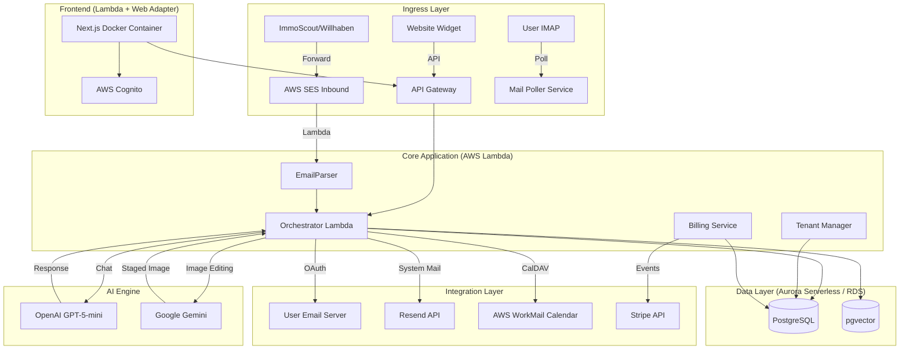

# System Architecture

## 🏗 High-Level Übersicht

Die Plattform basiert auf einer **AWS-Serverless-Architektur**, die auf Skalierbarkeit, Sicherheit und Wartungsarmut ausgelegt ist. Die Kernlogik ist in Node.js/TypeScript geschrieben und orchestriert die Kommunikation zwischen E-Mail-Providern, der KI-Engine und der Datenbank.

## 🧩 Komponenten-Details

### 1. Ingress & Lead Intake
*   **E-Mail Parser (AWS Lambda):** Verarbeitet eingehende E-Mails von Portalen. Nutzt Regex und DOM-Parsing, um Lead-Daten (Name, E-Mail, Telefon, Objekt-ID, Nachricht) zu extrahieren.
*   **Mail Poller:** Ein Hintergrund-Service, der optional IMAP-Postfächer der Makler auf neue direkte Antworten überwacht (für White-Labeling ohne Weiterleitung).

### 2. Core Application
*   **Orchestrator (Lambda + API Gateway):** Die zentrale Schaltstelle. Verwaltet den Status eines Leads (`NEW` -> `CONTACTED` -> `CONVERSATION` -> `BOOKED`). Entscheidet, wann die KI aufgerufen wird und wann ein Mensch eingreifen muss.
*   **Tenant Manager:** Verwaltet die Mandanten (Immobilienfirmen), deren Konfigurationen (SMTP-Zugangsdaten, Routing-Regeln) und Benutzerrechte.
*   **Encryption Service:** AES-256-GCM Verschlüsselung für sensible Daten (FTP-Passwörter, API-Keys, OAuth-Tokens).
*   **PDF Service:** Generiert Exposé-PDFs mit Puppeteer, inkl. QR-Codes für Videos/360°-Touren.
*   **Email Service:** OAuth-Integration für Gmail und Outlook Mail (Token-Management, Senden/Empfangen).
*   **Calendar Service:** OAuth-Integration für Google Calendar und Microsoft Outlook Calendar.

### 3. Data Layer
*   **PostgreSQL:** Speichert relationale Daten: Tenants, Users, Leads, Properties, CalendarEvents.
    *   **Dev/Stage:** RDS Single Instance (`t4g.micro`) zur Kostenoptimierung.
    *   **Lokal:** Neon.tech (serverless Postgres) für lokale Entwicklung.
    *   **Prod:** Aurora Serverless v2 für Skalierbarkeit und HA.
*   **pgvector:** Speichert Embeddings von Exposés und vergangenen Konversationen, um der KI ein "Langzeitgedächtnis" zu geben (RAG - Retrieval Augmented Generation).

### 4. AI Engine
*   **Chat & Tools:** OpenAI GPT-5-mini — Jarvis-Assistent für Lead-Kommunikation, CRM-Aktionen, Exposé-Erstellung.
*   **Image Editing:** Google Gemini (gemini-2.5-flash-image) — Virtual Staging im KI-Bildstudio.
*   **Aufgaben:**
    *   **Intent Recognition:** Was will der Lead? (Besichtigung, Frage, Absage?)
    *   **Response Generation:** Erstellen von natürlichen, mehrsprachigen Antworten.
    *   **Extraction:** Strukturierte Daten aus Freitext ziehen (z.B. Terminwunsch "nächsten Dienstag").
    *   **Exposé-Erstellung:** Live-Bearbeitung von Exposés im Editor via Tool-Calls.
    *   **Virtual Staging:** KI-basierte Bildbearbeitung (Möblierung, Renovierung) im Bildstudio.
    *   **Datei-Verarbeitung:** CSV/Excel-Import, PDF-Analyse, Bild-Erkennung.

### 5. Integration Layer
*   **E-Mail Outbound:**
    *   **Lead-Kommunikation (OAuth):** Gmail oder Outlook Mail über OAuth-Integration (White-Labeling über Makler-Domain).
    *   **System-E-Mails (Resend):** Benachrichtigungen, Erinnerungen, Eskalationen via Resend API (Absender: noreply@immivo.ai).
*   **E-Mail Inbound:** AWS SES empfängt E-Mails (Portal-Weiterleitungen) → Email-Parser Lambda extrahiert Lead-Daten.
*   **E-Mail Postfächer:** AWS WorkMail (dennis.kral@immivo.ai, josef.leutgeb@immivo.ai, office@immivo.ai, support@immivo.ai).
*   **Kalender:** AWS WorkMail Kalender via CalDAV (geplant: Google Meet Integration für Videocalls).
*   **Medien:** AWS S3 für Bildupload (Objekt-Fotos, Grundrisse, Bug-Report-Screenshots).
*   **Stripe:** Abwicklung von Subscriptions. Webhooks von Stripe aktualisieren den Lizenz-Status im `Tenant Manager`.

### 6. Frontend (AWS Lambda)
*   **Framework:** Next.js 15 (App Router).
*   **Hosting:** **AWS Lambda (Docker Image)**.
    *   Wir nutzen den **AWS Lambda Web Adapter**, um die Next.js App als normalen Webserver im Container laufen zu lassen.
    *   Dies ermöglicht "Scale to Zero" (0€ Kosten bei Inaktivität) und unendliche Skalierung bei Last.
*   **Auth:** AWS Cognito User Pool für sicheren Login/Registrierung (Custom UI, keine Amplify Authenticator).

## 🔒 Sicherheit & Compliance

### Datenhaltung
*   **Region:** Alle Daten verbleiben in AWS `eu-central-1` (Frankfurt).
*   **Verschlüsselung:** Datenbanken sind `At-Rest` verschlüsselt (AWS KMS). API-Traffic ist `In-Transit` verschlüsselt (TLS 1.3).
*   **Credentials:** SMTP-Passwörter und OAuth-Tokens werden mit AES-256-GCM verschlüsselt in der DB gespeichert.

### Multi-Tenancy
*   **Logische Trennung:** Jede Datenbank-Abfrage erzwingt einen `WHERE tenant_id = X` Filter.
*   **Automatische TenantId:** API-Endpoints holen die `tenantId` automatisch vom authentifizierten User.
*   **Rollen-Konzept:**
    *   `SUPER_ADMIN`: Systemweiter Zugriff.
    *   `ADMIN`: Verwaltet Firma, Billing, User.
    *   `AGENT`: Zugriff auf zugewiesene Leads und eigenen Kalender.

## ⚡️ Skalierbarkeit & Environments

### Infrastructure as Code (IaC)
Wir nutzen **AWS CDK (Cloud Development Kit)**, um die gesamte Infrastruktur im Code zu definieren.

### Environment-Strategie
1.  **Dev** (`Immivo-Dev`):
    *   Für die tägliche Entwicklung.
    *   **Deployment:** Automatisch bei Push auf `main` (GitHub Actions).
    *   Ressourcen: RDS Micro, Lambda Frontend (Scale to Zero).
2.  **Stage** (`Immivo-Stage`):
    *   Spiegelbild der Produktion.
    *   **Deployment:** Manuell via GitHub Actions (Workflow Dispatch).
3.  **Prod** (`Immivo-Prod`):
    *   Das Live-System.
    *   **Deployment:** Manuell via GitHub Actions (Workflow Dispatch).
    *   Backups und High-Availability aktiviert.

### Lokale Entwicklung
*   **Frontend:** `npm run dev` auf Port 3000
*   **Backend:** `npm run dev` auf Port 3001 (mit nodemon)
*   **Datenbank:** Neon.tech (kostenlose serverless Postgres)
*   **Uploads:** AWS S3 (Production), lokal in `./uploads` als Fallback (Development)
